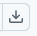

# Дни до Нового года + Проверка високосного года

## Описание
Простое веб-приложение, которое принимает дату в формате `дд.мм.гггг` или без разделителей (`20082025`) и выводит:
- Количество дней, оставшихся до Нового года (31.12.гггг).
- Информацию о том, является ли год високосным.

---

## Функционал
- Ввод даты пользователем.
- Автоматическая конвертация формата (например, `20082025` → `20.08.2025`).
- Проверка корректности введённой даты.
- Вывод ошибок красным жирным текстом.
- Расчёт количества дней до Нового года.
- Определение високосности года.

---

## Интерфейс
- Поле для ввода даты.
- Кнопка **Рассчитать**.
- Первый блок → количество дней до Нового года.
- Второй блок → високосный / не високосный.

---

## Технологии
- HTML5  
- CSS3  
- JavaScript (ES6)  

---

## Запуск
1. Перейти по ссылке в репозиторий:
https://github.com/iDeeGee/Synergy.Practice.GaidashDenis/blob/main/case4.html
2. Нажать на пиктограмму  "Download raw file"
3. Выбрать место на локальном диске, для сохранения файла.
4. Запустить файл case4.html

## Использование
1. Введите дату в формате дд.мм.гггг или без разделителей (20082025).
2. Нажмите кнопку Рассчитать.
3. Результат отобразится под полем ввода:
- количество дней до 31 декабря,
- високосный год или нет.
